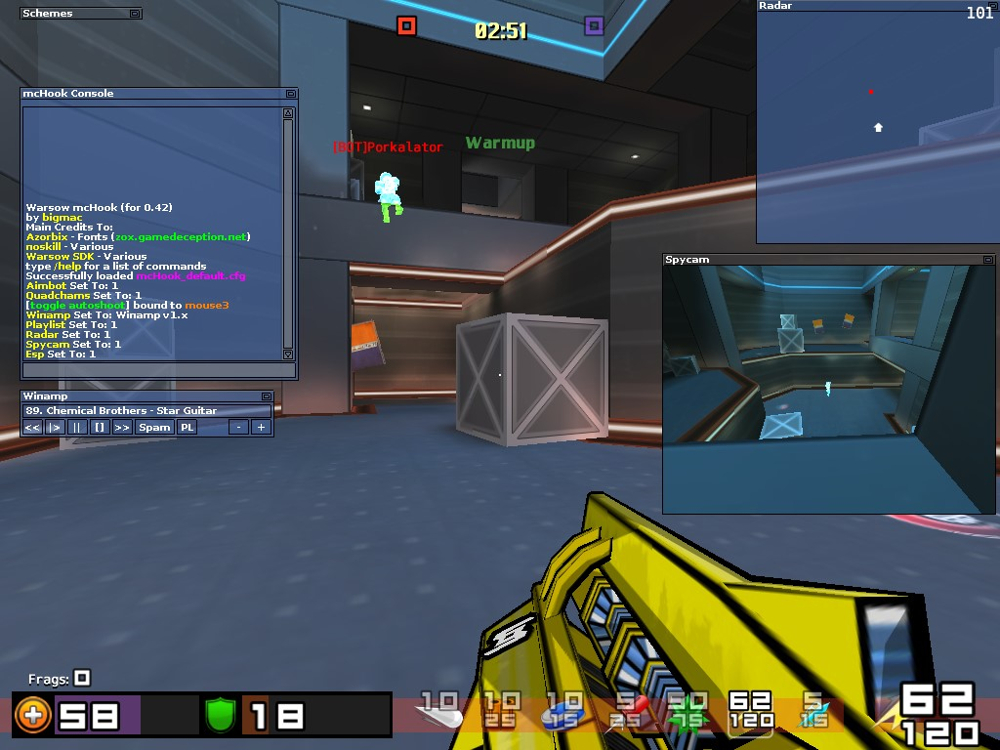
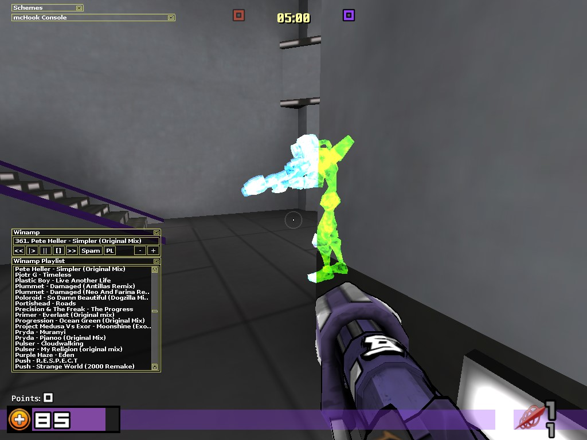
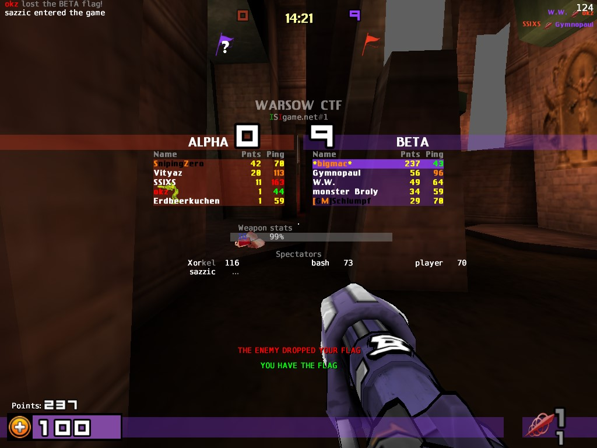

# mcHook

Source code for a [warsow](https://warsow.net/) v0.42 hack I made circa 2007-2008. Published purely for educational purposes.

I wrote this as a self-taught C++/OpenGL programmer aged 17/18. The only design pattern I knew of at the time was _inheritance_. It contains a mix of inline assembly and unsafe memory reads/writes necessary for hacking a multiplayer game. Overall it's a perfect example of what bad code looks like.

## Features
- Enemy radar
- Enemy spycam
- ESP
- Aimbot
- Wallhack
- Quadchams
- Enemy brightener
- Autoshoot
- In-game Winamp UI

## Screenshots

